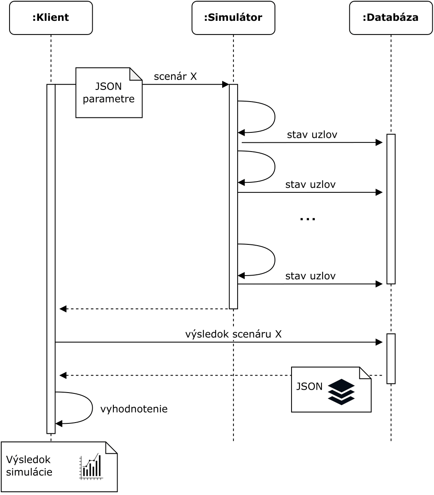

# Simulator client

*Wittgenstain simulator server must already running!*

## Prerequisities
Python3.8

`$ pip install -r requirements.txt`

## How to use

* Show general help: `python client.py -h`
* Show help for specific protocol `python client.py harmony -h`
* Run simulation: `python client.py --mongoserver mongodb:27017 harmony --scenario01`
  * `--mongoserver` specifies address of mongoDB (use `mongodb:27017`, it is an address of docker image)
  * `harmony` specifies protocol to simulate (`harmony`, `solana`, `ouroboros`)
  * `--scenario01` specifies experiment to simulate (print help of given protocol to see available scenarios)

View results of simulation in the directory `/output`.

**Simulation may take from minutes to hours (depends on simulation scenario)!**
## Harmony

* `--scenario01` - Sharding distribution security:
  * 1000 nodes, 4 shards, various lambdas, uniform stake distribution 
  * Plot heatmap of spearman correlation for each shard
* `--scenario02` - Shard control attack:
  * 1000 nodes, 4 shards, 600 lambda, uniform stake distribution, various byzantine nodes
  * Plot histogram of voting stake for byzantine nodes (1000 epochs)
* `--scenario03` - Sharding throughput:
  * transaction with size >600B
  * plot Tx/slot, MB/slot for various network size
* `--scenario04` - DDoS leaders
  * Simulate DDoS attack to a leaders.
* `--scenario05` - VRF feature
  * Simulate DDoS attack to a leaders with VRF feature.

## Solana
* `--scenario01` - Ratio of voting / nonvoting transactions:
  * 1000 or 10 000 nodes with various TPS (1000, 10_000, 20_000, 50_000) 
  * Plot area graph that shows ratio of voting vs. nonvoting transaction for these networks.
* `--scenario02` - DDoS attack to leader:
  * 1500 nodes, uniform vs real stake distribution
  * Attack to various number of leaders (0, 5 , 10, ..., 50)
  * Show TX throughput drop
* `--scenario03` - Show Solana voting protocol data traffic overhead
  * network nodes (1000, 2000, 5000, 10_000), increasing TPS
  * plot Tx/slot, MB/slot for various network size
* `--scenario04` - DDoS leaders with VRF feature
  * Simulate DDoS attack to a leaders, but with VRF feature instead of leader schedule.

## Ouroboros
* `--scenario01` - DDoS attack to leader:
  * 1500 nodes, number of nodes under attack (0, 30, 60, 90)
  * Plot drop in TPS.
* `--scenario02` - Forking attack
  * 1500 nodes
  * Show forks in time
* `--scenario03` - DDoS leaders with VRF feature
  * Simulate DDoS attack to a leaders, but with VRF feature instead of leader schedule.